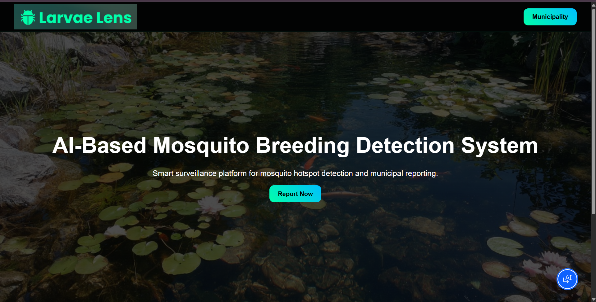
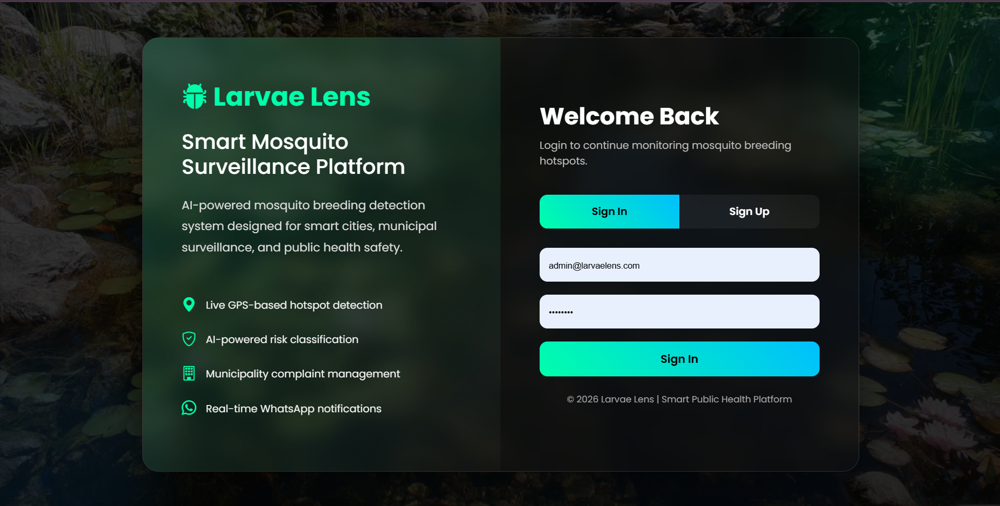
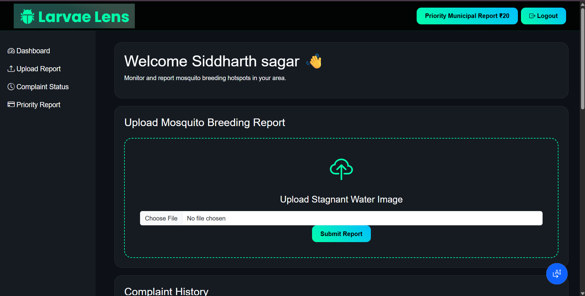

# 🦟 Larvae Lens

AI-Based Mosquito Breeding Detection and Municipal Surveillance System.

Larvae Lens is a smart surveillance platform designed to detect mosquito breeding hotspots using Computer Vision and AI-based image classification. The system allows citizens to report stagnant water locations, automatically classifies the breeding risk level, and notifies municipalities through a centralized dashboard and WhatsApp alerts.

---

# 🚀 Features

✅ AI-Based Risk Classification  
✅ Smart Stagnant Water Detection  
✅ Municipality Dashboard  
✅ User Complaint Portal  
✅ WhatsApp Alert System  
✅ GPS-Based Location Tracking  
✅ Complaint History Tracking  
✅ Priority Municipal Reports  
✅ Real-Time Map Visualization  
✅ Cloud Database Integration  

---

# 🛠 Technologies Used

## Frontend
- HTML
- CSS
- Bootstrap
- JavaScript

## Backend
- Python
- Flask

## AI & Image Processing
- OpenCV
- NumPy
- Computer Vision

## Database
- IBM Cloudant

## APIs & Services
- Twilio WhatsApp API
- Geolocation API
- OpenStreetMap / Leaflet.js

## Deployment
- GitHub Pages
- Render

---

# 🧠 AI Classification Model

The system uses Computer Vision and heuristic AI-based classification techniques to analyze uploaded stagnant water images.

The classifier performs:

- HSV color analysis
- Green/murky water detection
- Brightness analysis
- Edge density analysis
- Water reflection detection

Based on these environmental factors, the system classifies breeding risk into:

- LOW Risk
- MEDIUM Risk
- HIGH Risk

---
## Phase 2 Goals

- CNN-based image classification
- Dataset collection
- Real-time analytics
- Heatmap visualization
- Smart prediction system
---
# 📸 Screenshots

## 🏠 Home Page

---

## 🔐 User Authentication

---

## 🏛 Municipality Dashboard

---

## 📍 Risk Reports & Map

---

## 📜 User Complaint History

---

## 👤 User Dashboard

---

# 🌐 Live Project

## Frontend
https://sidharth188.github.io/larvae-lens/

## Backend
https://larvae-lens-backend.onrender.com/

---

# 📌 Future Scope

- Deep Learning CNN Integration
- YOLO-Based Detection
- AI Heatmaps
- Municipality Analytics Dashboard
- Real-Time Outbreak Prediction
- Mobile Application Integration
- Smart City IoT Integration

---

# 👨‍💻 Developed By

Siddharth Sagar

---

# 📄 License

This project is developed for educational, research, and smart-city surveillance purposes.
